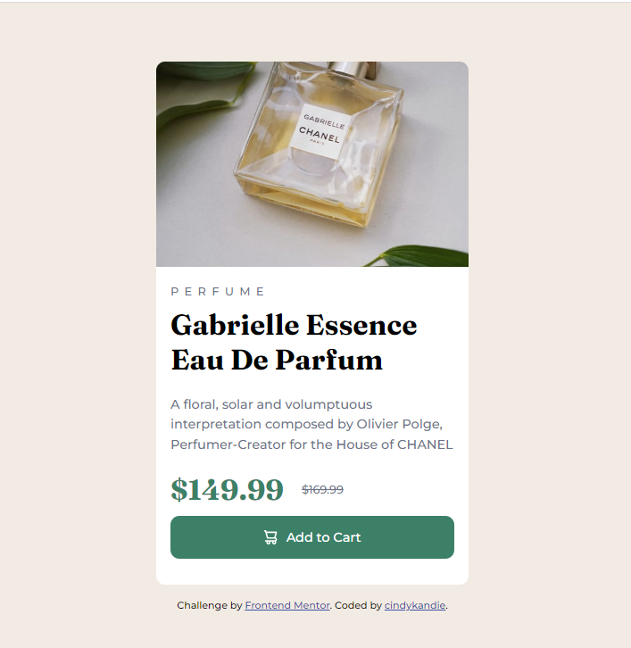

# Frontend Mentor - Product Preview card component
This project is a collaborative learning experience among four mentees and their mentor(me) 😊 and here is a link to the challenge ie the [inspiration design](https://www.frontendmentor.io/challenges/product-preview-card-component-GO7UmttRfa)

## Table of contents

- [Overview](#overview)
  - [Screenshot](#screenshot)
  - [Links](#links)
- [My process](#my-process)
  - [Built with](#built-with)
  - [What I learned](#what-i-learned)
  - [Continued development](#continued-development)
  - [Useful resources](#useful-resources)
- [Author](#author)
- [Acknowledgments](#acknowledgments)

## Overview

### Screenshot

### Links

- Solution URL: [SOLUTION ON GITHUB](https://github.com/cindykandie/product-preview-card/)
- Live Site URL: [LIVE SITE](https://cindykandie.github.io/product-preview-card/)

## My process

### Built with

- Semantic HTML5 markup
- CSS custom properties
- Flexbox
- Mobile-first workflow

### What I learned
I learnt how to create multiple background and balancing the ratios so its responsive

### Future features

Would like to have a more interactive eccomerce platform like this that leads to my personal website

## Author

- Website - [cindykandie](https://cindykandie.github.io/portfolio)
- Frontend Mentor - [@cindykandie](https://www.frontendmentor.io/profile/cindykandie)
- Twitter - [@cindy_kandie](https://www.twitter.com/cindy_kandie)
- LinkedIn - [@cindykandie](https://www.linkedin.com/in/cindykandie)

## Acknowledgments

Thanks to my mentees I make sure I start these challenge projects and complete them thats a really cool accountabilty style

